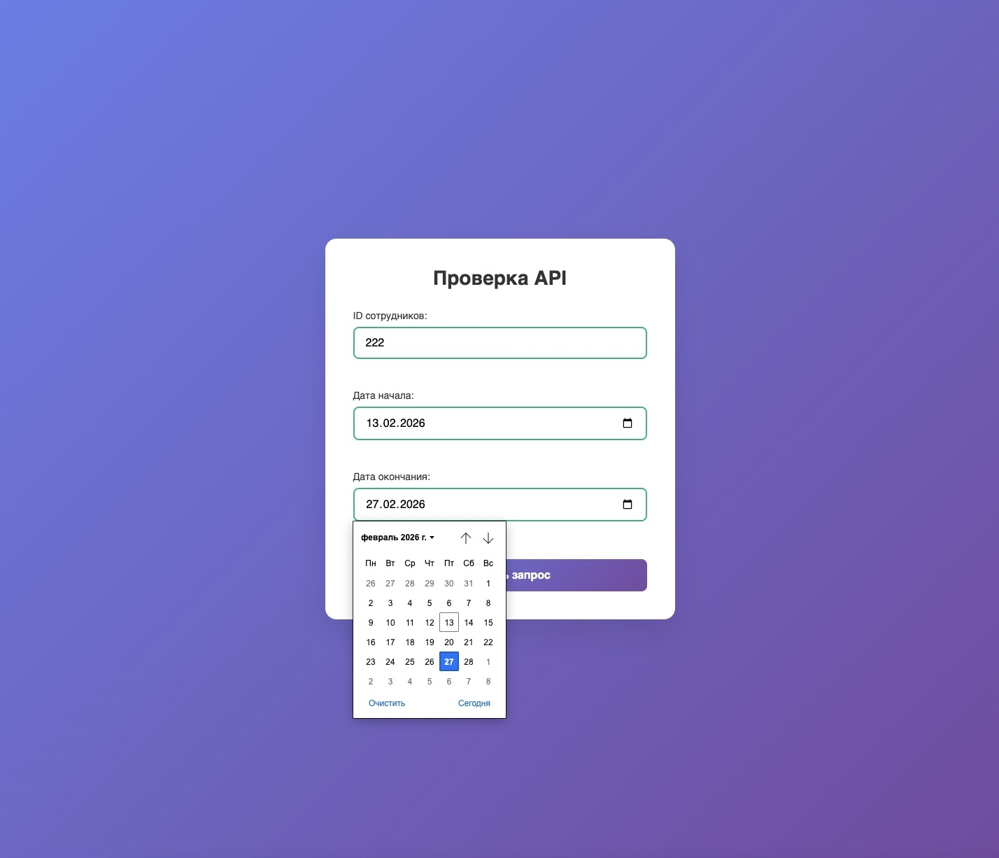
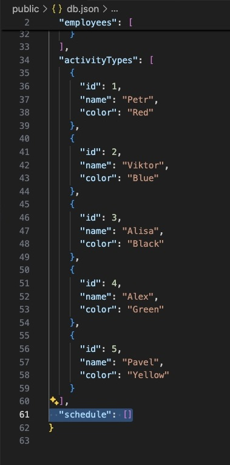
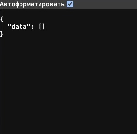
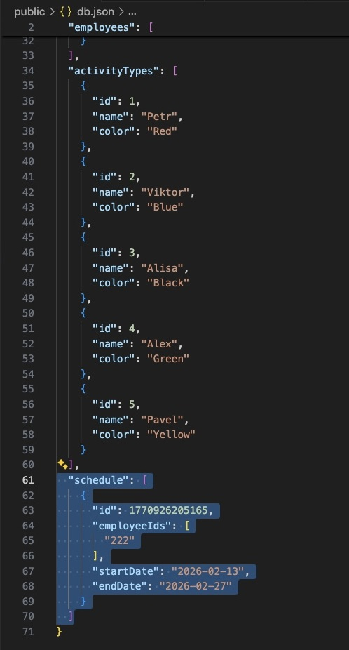
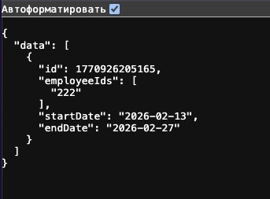

# Backend + Frontend-JS для записи пользователей на выбранные даты


Установка:

```bash
bun install
```

Фронтенд:

```bash
открыть frontend/index.html через Live Server
далее открыть сервер и посмотреть, какие данные передались
```

Чтобы запустить сервер:

```bash
bun run start
```

Для проверки API:

```bash
1 - http://localhost:3000
2 - http://localhost:3000/api/dictionaries/activity-types
3 - http://localhost:3000/api/employees
4 - http://localhost:3000/api/schedule/all
```

## О проекте

- Обновленная версия прошлого бэкенда `mock-api` - `https://github.com/Asumodeusu/mock-api`
  Раньше сервер только отдавал моки. Теперь он умеет принимать и сохранять данные с фронта.

**Что внутри:**

- Сервер на Elysia (Bun)
- Данные в LowDB — читает и пишет в db.json
- CORS открыт для всех — фронт на Live Server (5500) стучится на 3000 порт
- Пустой массив schedule — наполняется

**Добавил:**

1. POST-эндпоинт

- Принимает массив ID сотрудников, дату начала и конца.
- Валидирует через TypeBox. Сохраняет в db.json через db.write().

2. Фронтенд на чистом JS и HTML
3. CORS настроен под Live Server - поэтому origin: true.

**Собрал полный цикл:**
Фронт отправляет → сервер валидирует → сохраняет в JSON → данные не пропадают после перезапуска.

## Скриншоты





